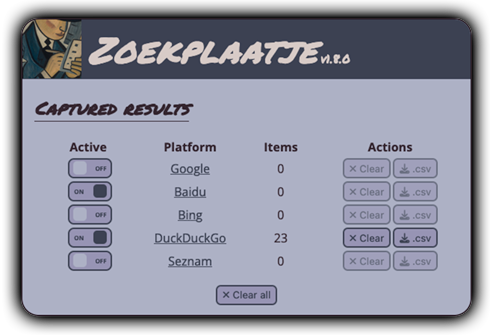

# 🕵️ Zoekplaatje

Zoekplaatje is a browser extension that monitors search results as you see them in your browser and allows you to later
download them as a .CSV spreadsheet. It is intended to facilitate systematic analysis of search results, e.g. for 
(algorithmic) bias.

Currently, it supports the following search engines:
* [Google](https://www.google.com)
* [Bing](https://www.bing.com)
* [Baidu](https://baidu.com)
* [DuckDuckGo](https://duckduckgo.com)
* [Seznam](https://seznam.cz)

Engine support requires regular maintenance to keep up with changes to the engines. If something does not work, we
welcome issues and pull requests.

The extension does not interfere with your normal browsing and never uploads data.

## Installation
Zoekplaatje is in active development. .xpi files that you can use to install it in your browser are available on the 
[releases](https://github.com/digitalmethodsinitiative/zoekplaatje/releases) page. These are signed and can be installed 
in any Firefox-based browser. If you want to run the latest development version instead, you can [do so from the Firefox
debugging console](https://www.youtube.com/watch?v=J7el77F1ckg) after cloning the repository locally.

## How to use
Install the browser extension in a Firefox browser. A button with the Zoekplaatje logo (a 'Z') will appear in the 
browser toolbar. Click it to open the Zoekplaatje interface. Enable capturing for the search engines you want to 
capture from.

Next, simply search for things as you normally would. While Zoekplaatje is enabled, results will be saved in the 
background. You can then download the results as a .csv file with the button in the interface when you are done and
want to inspect the results.

## Credits & license
Zoekplaatje was developed by Stijn Peeters for the [Digital Methods Initiative](https://digitalmethods.net) and is 
licensed under the Mozilla Public License, 2.0. Refer to the LICENSE file for more information.  It is heavily based on 
[Zeeschuimer](https://github.com/digitalmethodinitiative/zeeschuimer/).

Graphics based on [an image generated by Dall-E](https://labs.openai.com/s/oWvGAHC0pxwWV3bNLfENu7AV), for the prompt 
'detail of a 1914 metaphysical painting by giorgio de chirico depicting a hard-boiled detective writing down results in 
a notebook'. Interface background pattern by [Travis Beckham](https://travisbeckham.com/).

Development is supported by the Dutch [PDI-SSH](https://pdi-ssh.nl/en/) foundation through the [CAT4SMR 
project](https://cat4smr.humanities.uva.nl/).
